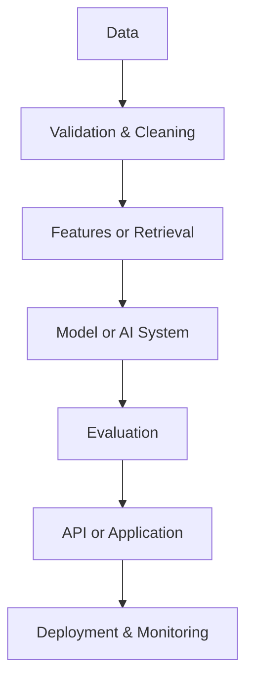

# Hi, I'm Md. Alif Hossen

### Entry-Level Machine Learning Engineer · Applied AI Developer · Data Scientist

**I build practical AI systems that move from data to decisions.**

CSE graduate building end-to-end solutions across RAG, fraud risk, demand forecasting, computer vision, and analytics—with evaluation, APIs, testing, monitoring, and deployment in the loop.

📍 Dhaka, Bangladesh · Open to entry-level AI/ML, Data Science, and Data Analytics opportunities

---

## About Me

I am a B.Sc. in Computer Science & Engineering graduate from Daffodil International University. My work focuses on building practical machine-learning and applied-AI systems beyond isolated notebooks—through reproducible pipelines, careful validation, APIs, interactive applications, automated tests, and deployable workflows.

Across my projects, I work with retrieval systems, cost-sensitive classification, forecasting, computer vision, explainability, and monitoring concepts. I am seeking an entry-level role where I can contribute to useful AI and data products while continuing to strengthen production ML engineering skills.

## Core AI/ML Focus

| Focus | What I Work On |
|---|---|
| **Machine Learning Engineering** | Reproducible pipelines, validation, evaluation, inference APIs, and tested applications |
| **Applied AI & RAG** | Hybrid retrieval, reranking, grounded answers, and structured financial research |
| **Fraud Risk Modelling** | Temporal validation, calibration, explainability, and cost-sensitive thresholds |
| **Forecasting & Decision Systems** | Leakage-safe time-series modelling, uncertainty, and inventory recommendations |
| **Computer Vision** | Video detection, tracking, OCR, and reviewable screening workflows |
| **Data Analytics** | Python, SQL, Power BI, Excel, visualisation, and decision-oriented analysis |

---

## Featured Projects

> Live demos are hosted on Streamlit Community Cloud and may take a few seconds to wake up.

### SEC Filings RAG Intelligence

**Problem:** Financial filings are long and difficult to search reliably while preserving source context.

**What I built:**
- Citation-grounded research over SEC 10-K and 10-Q filings
- Structure-aware processing with hybrid BM25 + FAISS retrieval, reciprocal-rank fusion, and cross-encoder reranking
- SEC XBRL Company Facts integration and deterministic financial calculations behind FastAPI and Streamlit

**Technical highlights:** Python · BM25 · FAISS · Sentence Transformers · FastAPI · Streamlit · SQLite · Docker · pytest

**Why it matters:** It turns complex regulatory filings into a traceable research workflow instead of relying on unsupported model-generated answers.

### Real-Time Transaction Fraud Risk & Monitoring Platform

**Problem:** Fraud classifiers need more than accuracy—they require time-aware validation, calibrated risk scores, explainability, and decision thresholds.

**What I built:**
- Fraud-risk pipeline with temporal separation and validation-based model selection
- Probability calibration, cost-sensitive thresholds, and SHAP-based reason codes
- FastAPI inference, Streamlit application, tests, monitoring modules, and optional PostgreSQL persistence

**Technical highlights:** Python · Logistic Regression · LightGBM · XGBoost · SHAP · FastAPI · Streamlit · PostgreSQL · MLflow · Evidently · Docker · pytest

**Why it matters:** It connects model predictions to explainable, cost-aware decisions and operational monitoring concepts.

### Retail Demand Forecasting & Inventory Optimization

**Problem:** Demand forecasts are useful only when validated correctly and translated into inventory decisions.

**What I built:**
- M5-based workflow with leakage-safe lag and rolling features
- Seasonal Naive and LightGBM models with chronological validation and rolling-origin backtesting
- Prediction intervals and inventory recommendations through a FastAPI-backed Streamlit application

**Technical highlights:** Python · Pandas · LightGBM · Time-Series Validation · FastAPI · Streamlit · Docker · GitHub Actions

**Why it matters:** It connects forecast uncertainty with practical safety-stock, reorder, and stock-risk decisions.

### AI-Based Real-Time Traffic Violation Detection System

**Problem:** Reviewing long road-video recordings manually is slow and makes potential traffic events difficult to organise.

**What I built:**
- Academic video-screening prototype using YOLO detection, DeepSORT-style tracking, plate-region detection, and EasyOCR
- Annotated video, vehicle crops, summary counts, and CSV exports through Streamlit
- Transparent rule-based outputs designed for review rather than automatic enforcement

**Technical highlights:** Python · YOLO · OpenCV · DeepSORT · EasyOCR · NumPy · Pandas · Streamlit · pytest

**Why it matters:** It organises potential events for faster review while keeping human judgement in the loop.

> Speed and lane results are heuristic screening outputs that require human review.

### Project Portfolio Map

| Project | Domain | AI/ML Focus | Application |
|---|---|---|---|
| SEC Filings RAG | Financial research | Hybrid retrieval and reranking | FastAPI + Streamlit |
| Fraud Risk & Monitoring | Financial risk | Calibrated classification and explainability | API + dashboard + monitoring |
| Retail Demand Forecasting | Retail and inventory | Forecasting and uncertainty | Decision-support application |
| Traffic Violation Detection | Computer vision | Detection, tracking, and OCR | Video-screening application |

---

## End-to-End Engineering Workflow

My projects focus on moving beyond notebook-only experimentation toward reproducible, testable, and usable AI applications. They are portfolio and academic systems—not claims of enterprise production experience.

## Technical Stack

| Area | Technologies |
|---|---|
| **Languages** | Python · SQL |
| **Data & Analytics** | Pandas · NumPy · Data Cleaning · Matplotlib · Seaborn · Plotly · Excel · Power BI · Jupyter |
| **Machine Learning** | Scikit-learn · Logistic Regression · LightGBM · XGBoost · Feature Engineering · Model Evaluation · Probability Calibration · Time-Series Validation |
| **Applied AI & NLP** | RAG · BM25 · FAISS · Embeddings and Retrieval · Cross-encoder Reranking · SEC EDGAR · XBRL |
| **Computer Vision** | OpenCV · YOLO · DeepSORT · EasyOCR · Object Detection · Object Tracking · OCR |
| **Backend & Applications** | FastAPI · Streamlit · REST APIs · Pydantic |
| **Databases** | PostgreSQL · SQLite · SQLAlchemy |
| **Testing & Engineering** | pytest · Docker · Git · GitHub · GitHub Actions · MLflow · SHAP · Evidently |

## Engineering Practices

- **Reproducible workflows:** structured projects, configuration, dependencies, and repeatable execution
- **Reliable evaluation:** temporal splits, baselines, calibration, backtesting, and leakage-aware validation
- **Explainable outputs:** SHAP reason codes, citations, deterministic calculations, and reviewable results
- **Usable delivery:** FastAPI inference, Streamlit interfaces, persistence, and containerisation
- **Quality controls:** automated tests, GitHub workflows, monitoring concepts, and explicit limitations

## Currently Improving

- Production ML engineering and maintainable service design
- MLOps workflows, experiment tracking, and model monitoring
- Advanced RAG evaluation and retrieval quality
- Scalable ML APIs and reliable deployment practices

These are active learning areas, not claims of professional production expertise.

## Current Focus

- **Applied AI:** grounded retrieval and practical RAG applications
- **ML Engineering:** validation, explainability, APIs, and testing
- **Decision Systems:** forecasting, inventory optimisation, and fraud-risk modelling
- **Computer Vision:** reviewable video-analysis and OCR workflows

---

## Education

| Qualification | Institution | Result |
|---|---|---:|
| **B.Sc. in Computer Science & Engineering** | Daffodil International University | **CGPA 3.33/4.00** |
| **Higher Secondary Certificate (HSC), Science** | Shahid Mamun Mahmud Police Lines School & College, Rajshahi | **GPA 5.00/5.00** |
| **Secondary School Certificate (SSC), Science** | Goal Manda High School | **GPA 5.00/5.00** |

## GitHub Activity

  <picture>
    <source media="(prefers-color-scheme: dark)" srcset="https://github-readme-stats.vercel.app/api?username=Alif1642&show_icons=true&hide_border=true&theme=transparent&title_color=14B8A6&text_color=C9D1D9&icon_color=0EA5E9" />
    <source media="(prefers-color-scheme: light)" srcset="https://github-readme-stats.vercel.app/api?username=Alif1642&show_icons=true&hide_border=true&title_color=0F766E&text_color=0F172A&icon_color=0284C7" />
    
  </picture>
  <picture>
    <source media="(prefers-color-scheme: dark)" srcset="https://github-readme-stats.vercel.app/api/top-langs/?username=Alif1642&layout=compact&hide_border=true&theme=transparent&title_color=14B8A6&text_color=C9D1D9" />
    <source media="(prefers-color-scheme: light)" srcset="https://github-readme-stats.vercel.app/api/top-langs/?username=Alif1642&layout=compact&hide_border=true&title_color=0F766E&text_color=0F172A" />
    
  </picture>

> Most-used languages reflects repository composition, not proficiency.

---

## Connect With Me

I am open to entry-level opportunities in AI/ML Engineering, Machine Learning, Applied AI, Data Science, and ML-focused Data Analytics.

